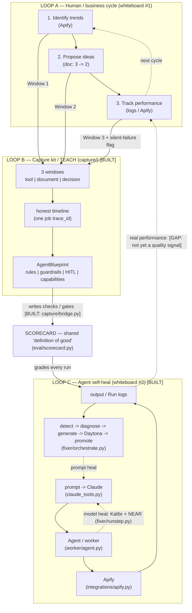

# Where we are now — the full flow

Your two whiteboard sketches are the two halves of one self-improving system:

- **Whiteboard #1** (identify → propose → track, looping) = the **human / business cycle** the capture kit watches.
- **Whiteboard #2** (prompt → Claude → Agent → Apify → output, with feedback) = the **agent self-heal runtime**.

They meet at the **scorecard** — the shared definition of "good." The human *writes* the
checks (top-down); the outside systems *optimize against* them (bottom-up).

## Your sketches → current code

| Whiteboard #1 step | Run-time module | Capture-kit module |
|---|---|---|
| 1. Identify trends (Apify) + `[1][2][3]` pick | `integrations/apify.py`, `/tools/scrape_trends` | `capture/windows.record_tool_use` (Window 1) + `record_decision` (Window 3 — the *why* of the pick) |
| 2. Propose content ideas (doc) | `worker/agent.py` | `capture/windows.record_doc_revision` (Window 2) |
| 3. Track performance (logs / Apify) | `eval/scorecard.py` + `fixer/detect.py` on `Run` logs | `capture/silent_failure.py` (flags bad-data scrape) |
| the big loop arrow | the two self-heal loops below | the capture → blueprint "teach" loop |

| Whiteboard #2 node | Module |
|---|---|
| prompt → Claude | `claude_tools.py` (Claude calls the tools) |
| Agent | `worker/agent.py` (each call wrapped by `fixer/runstep.py`) |
| Apify | `integrations/apify.py` |
| O (output) | `ContentDraft` / `Run` (`core/contracts.py`) |
| Agent → Claude feedback | model heal (Kalibr, `fixer/runstep.py`) + prompt heal (`fixer/orchestrate.py`) |

## Does it work? Build status of each connection

**Built + verified (`demo.py`, `python -m capture.demo`):**
- Loop C agent self-heal: model-level (Kalibr/NEAR) and prompt-level (Daytona promote-if-better).
- Loop B capture → timeline → blueprint.
- Window 3 silent-failure flag → guardrail.

**Still open (to make it a fully closed dual loop):**
1. **Blueprint → scorecard bridge** — **now wired** (`capture/bridge.py`): each blueprint `rule` carrying an `avoid` token compiles into a deterministic check folded in via `score_output(..., extra_checks=...)`. This is the link that makes *"the user improves the system"* automatic.
2. **Real performance → quality signal** — "track performance" in whiteboard #1 implies engagement outcomes loop back, but current "quality" = scorecard constraint-compliance, not actual post performance. Good-but-underperforming content isn't penalized yet.
3. **trace_id join** — job-level (capture) vs per-step (Kalibr) live side by side; `data["child_trace_id"]` exists but nothing populates it during a live run.
